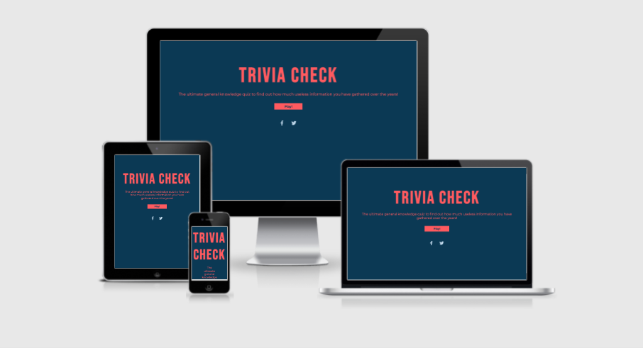
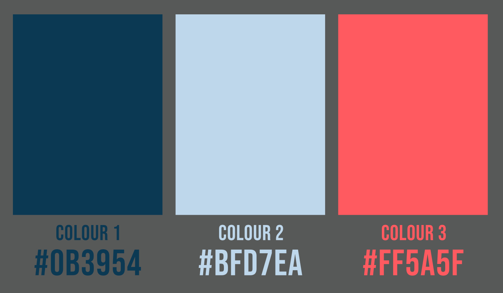
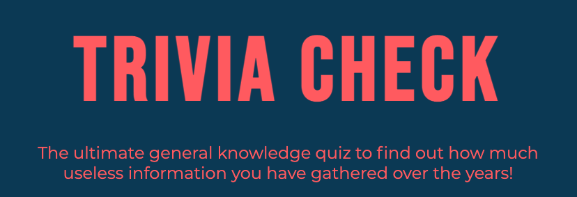
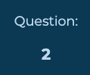
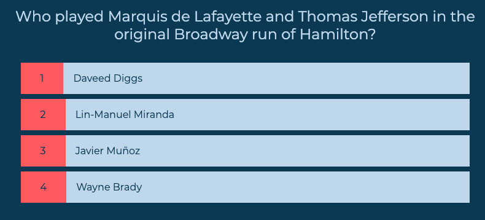
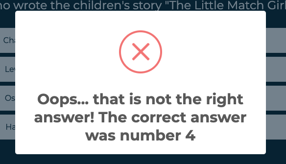
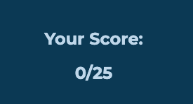

[View the deployed site here](https://beth-t93.github.io/ci_ms2_trivia/)

## Table of Contents

- [Project Goals](#project-goals)
- [User Experience](#user-experience)
    - [User Goals](#user-goals)
    - [Target Audience](#target-audience)
    - [User Stories](#user-stories)
    - [User Requirments and Expectations](user-requirements-and-expectations)
    - [Scope](#scope)
    - [Structure](#structure)
- [Design Choices](#design-choices)
    - [Colours](#colours)
    - [Fonts/Typography](#fonts-typography)
    - [Imagery](#imagery)
- [Wireframes](#wireframes)
- [Technologies Used](#technologies-used)
    - [Languages](#languages)
    - [Frameworks, Librabries and Other Tools](#frameworks-libraries-and-other-tools)
- [Features](#features)
- [Future Features](#future-features)
- [Validation and Testing](#vlaidation-and-testing)
    - [HTML Validation](#html-validation)
    - [CSS Validation](#css-validation)
    - [Acessibility](#accessibility)
    - [Performance](#performance)
    - [Testing on Other Devices](#testing-on-other-devices)
    - [Testing of User Stories](#testing-of-user-stories)
- [Bugs](#bugs)
- [Deployment](#deployment)
- [Credits](#credits)
- [Acknowledgements](Acknowledgements)

## Project Goals
The aim of this project is to create a simple and easy to navigate quiz game. The information for the questions will be pulled from a trivia API so as to allow a bigger range of questions, as well as the ability for new questions to be added without the need to program new questions directly into the site.

This constant flow of new questions will reduce the risk of users getting bored of too many repeat questions.

The quiz will appeal to a large target audience, from first time quizzers, to seasoned professionals who take part in a pub quiz every week.

## User Experience
### User Goals
- An easy to use site
- Start the game quickly and easily
- Be constantly engaged during the game with feedback on answers
- The questions will be updated regularly to avoid repeat questions
- The site will be eye-catching, but also uses a design and colour scheme that is not difficult to read and use.

### Target Audience
- Quiz enthusiasts
- Someone looking to pass the time without having to invest time in signing up to a site
- A casual user

### User Stories
#### Visitor Goals
1. As a visitor I want the site to be easy and simple to use.
2. As a visitor I want the site to be colourful and eye-catching, as well as be easy to read.
3. As a visitor I would like to be able to start a quiz quickly
4. As a visitor I would like to have feedback on my answers
5. As a visitor I want to be able to return to the site and not get the same questions every time.
6. As a visitor I would like to be able to see my final score
7. As a visitor I would like to keep up to date with any new quiz content via social media.
#### Site Owner Goals
8. As a site owner I want the site to be easy to use.
9. Keep the maintenance of the site as minimal as possible by using an API to source the quiz questions.
10. Ensure there is a variety of questions so users will not get the same set of questions if they play more than once.

### User Requirements and Expectations
#### Requirements
- Easy to navigate
- Appealing design
- Relevant information to guide the user through the game
- Clean design that further helps the user navigate through a game with no distractions.

#### Expectations
- Buttons take you to the page they say they will
- Social media links will open in a separate tab
- To receive feedback on answers, whether they are correct or not

## Scope
Based on the above information, features to be included in the design include:
- An easy to navigate homepage with an obvious path to the game itself
- A seperate game page that will be easy to use and will be accessible for users
- Favicon to help users identify the site in any tabs.

## Structure
A responsive trivia quiz site consisiting of 2 pages

The site will be easy to use across all devices, enabling the user to start a quiz quickly from pretty much anywhere.

## Design Choices
The style of the site will be simple and minimal so it remains easy to navigate, but also so it keeps the users attention to finish the quiz, and even complete multiple rounds of questions.

### Colours
The colour scheme for this site is meant to be bright and eye catching to the user, however there should still be enough contrast between the colours used so that the site remains easy to read and navigate for longer periods of time.

I have chosen a colour scheme that is bright and eye-catching to the user.
 - Colour 1: (Hex: #0B3954) This is a dark blue that is used for the background thoughout the whole site, it gives the other content a darker background so it is able to stand out from the page. This colour is also used for the text colour on the buttons of the site.
 - Colour 2: (Hex: #BFD7EA) I chose this colour to contrast well with the background colour, it will be used throughout the site for key information, such as the quiz questions and social media icons.
 - Colour 3: (Hex: #FF5A5F) This colour is used as a fun pop of colour against the dark background. It will be used for the logo and test content on the home page, as well as give emphasis to other items on the site, such as the answer selection boxes.
### Fonts/Typography
To ensure the website is easily readable while also keeping to the simple and minimal design, the fonts used are: Bebas Neue for headings and the logo and Montserrat for all other text (these are taken from Google Fonts library) with sans-serif being the fallback font should either of the selected fonts be unavailable. 

## Skeleton

## Surface

### Wireframes
- [Home - desktop](docs/wireframe/index-desktop-wireframe.pdf)
- [Home - tablet](docs/wireframe/index-tablet-wireframe.pdf)
- [Home - mobile](docs/wireframe/index-mobile-wireframe.pdf)

- [Game - desktop](docs/wireframe/game-desktop-wireframe.pdf)
- [Game - tablet](docs/wireframe/game-tablet-wireframe.pdf)
- [Game -mobile](docs/wireframe/game-mobile-wireframe.pdf)

## Technologies Used

### Languages
- [HTML5](https://en.wikipedia.org/wiki/HTML5)
- [CSS3](https://en.wikipedia.org/wiki/CSS)
- [JavaScript](https://en.wikipedia.org/wiki/JavaScript)

### Frameworks, Libraries and Other Tools
1. [Affinity Designer](https://affinity.serif.com/en-gb/designer/) was used to create the inital logo idea and colour swatch - I ended up using plain text in the logo so chose to code this in html rather than using an image file.
2. [Sweet Alert](https://sweetalert2.github.io/) was used to create modals for user feedback on each answer.
3. [Git](https://git-scm.com/) was used within VS Code for version control to push code to GitHub.
4. [Github](https://github.com/) was used as a remote repository to store code.
5. [Am I Responsive](http://ami.responsivedesign.is/) was used to create the mockup you see at the start of this README.md file
6. [Coolors](https://coolors.co/) was used to help put together the colour scheme used throughout the site.
7. [Visual Studio Code](https://visualstudio.microsoft.com/) is the IDE I used to develop the project.
8. [Balsamiq](https://balsamiq.com/) was used to create the wireframes for the site
9. [Font Awesome](https://fontawesome.com/) was used for the icons throughout the site.
10. [Google Fonts](https://fonts.google.com/) Bebas Neue was used for headings, while Montserrat was used for body text.
11. [Open Trivia Database](https://opentdb.com/api_config.php) was used as an API for the quiz questions.

## Features
#### Feature 1 - Homepage
The homepage is made up of three feautres:
1. The title section
2. The play button
3. Social media links
##### 1. Title

- This is the first thing you see when you get to the site so I decided this needed to be easy to read, but still follow the bright colour scheme of the site.
- As I wanted to keep the logo simple I used text only, in a bold, striking font.
- The paragraph on this page gives the user an idea of the kind of quiz they are about to start.
###### User stories covered by this feautre:
1. As a visitor I want the site to be easy and simple to use.
2. As a visitor I want the site to be colourful and eye-catching, as well as be easy to read.
8. As a site owner I want the site to be easy to use.

##### 2. Play button

- This is centrally located on the page making it easy for a user to start a game
- The colour matches the text and title above to make the site eye-catching for the user.
###### User stories covered by this feautre:
1. As a visitor I want the site to be easy and simple to use.
2. As a visitor I want the site to be colourful and eye-catching, as well as be easy to read.
3. As a visitor I would like to be able to start a quiz quickly
8. As a site owner I want the site to be easy to use.

##### 3. Social media links

- I added these links so that users would be able to keep up to date with any future developments with the quiz, such as new categories or the addition of a leaderboard.
- The colour I chose for these is a lighter blue which offers more of a contrast with the rest of the page.
###### User stories covered by this feautre:
7. As a visitor I would like to keep up to date with any new quiz content via social media.

#### Feature 2 - Quiz and Score Page
- This page is made up of two majaor sections, the quiz itself and then the final score.

##### The question counter

- This lets the user know how many questions they have completed.

##### The quiz

- To create the layout for this page I used separate divs for the answers, allowing the different parts to be customised separatley.
- To give the user feedback on which answer they were on I added a hover class to transform the div whenever a mouse goes over it.
- I kept to the same minimal design, like on the homepage to keep the site looking clean and still make it easy to use.
- The questions will all be pulled from the [Open Trvia API](https://opentdb.com/api_config.php). This makes sure there is a large number of questions that could be used in the quiz
###### User stories covered by this feautre:
1. As a visitor I want the site to be easy and simple to use.
2. As a visitor I want the site to be colourful and eye-catching, as well as be easy to read.
4. As a visitor I would like to have feedback on my answers
5. As a visitor I want to be able to return to the site and not get the same questions every time.
8. As a site owner I want the site to be easy to use.
9. Keep the maintenance of the site as minimal as possible by using an API to source the quiz questions.
10. Ensure there is a variety of questions so users will not get the same set of quesitons if they play more than once.

##### Sweet Alert

- I decided to use [Sweet Alert](https://sweetalert2.github.io/) to give users feedback one their answer, and to inform them of the correct answer should they get it wrong.
###### User stories covered by this feautre:
4. As a visitor I would like to have feedback on my answers

##### Score area

- This tells the user how may questions they got correct.
- I kept the design of this part of the page simple, allowing the user to clearly see their final score.
###### User stories covered by this feautre:
2. As a visitor I want the site to be colourful and eye-catching, as well as be easy to read.
4. As a visitor I would like to have feedback on my answers
6. As a visitor I would like to be able to see my final score

##### Back home button

- This button is desigined to stand out from the rest of the page, enabling the user to easily go back to the start to play agian.

###### User stories covered by this feautre:
1. As a visitor I want the site to be easy and simple to use.
3. As a visitor I would like to be able to start a quiz quickly

## Future Features
Something I would look to add in the future is the ability to choose a specific topic and question difficulty to make completing multiple rounds of the quiz more appealing. 

I would also look at adding leaderboards per topic.

## Validation and Testing

### HTML Validation
I used the [W3C Markup Validation Service](https://validator.w3.org/) to validate the HTML of the website. All pages passed with 0 errors and 0 warnings.

- [Home](docs/validation/html/html-validation-index.png)
- [Game](docs/validation/html/html-validation-quiz.png)
### CSS Validation
I used the [W3C CSS Validation Service](https://jigsaw.w3.org/css-validator/) to validate the CSS of the website.

- [CSS](docs/validation/css/css-validation.png)

### JavaScript Validation

### Accessibility
I used the [WAVE Web Accessibility Evaluation Tool](https://wave.webaim.org/) to check that my website was accessible.

- [Home](docs/validation/accessibility/wave-index.png)
- [Game](docs/validation/accessibility/wave-game.png)

### Performance
I used [Google Lighthouse](https://developers.google.com/web/tools/lighthouse) to measure the performance and speed of my website.

- [Home](docs/validation/lighthouse/lighthouse-index.png)
- [Game](docs/validation/lighthouse/lighthouse-quiz.png)

### Testing on other devices

#### Devices tested:
- iPhone 12 Pro
- Samsung Galaxy s20+
- iPad Pro 11"
- 21.5" iMac
- Asus Chromebook Flip C434TA

#### Browser Testing
- Chrome
- Brave (Chromium)
- Safari

#### Tests Performed
- The 'play' button on the homepage successfully takes you to a quiz.
- The social media links on the homepage open to the corresponding site in a new tab.
- The 'back home' button on the score page successfully takes you back to the homepage.
- All pages are repsonsive so the site looks and works the same on all screen sizes
- The Sweet Alert modals on the quiz page work correctly giving the user feedback on their answer.
- All text on the site is clear and legible.
- The score page tells you how many questions you got correct out of the total amount of questions in the quiz.
- The answer options on the quiz page change colour in response to the selected answer being correct or incorrect.
- The ansewr options transform on hover, allowing the user to see what answer they are hovering over before they select.

#### Results
All devices passed the tests

### Testing User Stories

1. As a visitor I want the site to be easy and simple to use.
    
    | Feature | Action | Expected Result | Actual Result |
    | ------- | ------ | --------------- | ------------- |
    | Simple, easy to use design | User is able to navigate to all parts of the site | User is able to successfully complete the quiz easily | Works as expected |

2. As a visitor I want the site to be colourful and eye-catching, as well as be easy to read.
    
    | Feature | Action | Expected Result | Actual Result |
    | ------- | ------ | --------------- | ------------- |
    | Bright colour scheme that is also still legible | All colours used on the site are bright and colourful, but still allow good legibility | Users find the site eye-catching and have no issues with the sites ease of use | Works as expected |

3. As a visitor I would like to be able to start a quiz quickly

    | Feature | Action | Expected Result | Actual Result |
    | ------- | ------ | --------------- | ------------- |
    | Easy to see play button on the first page as the site loads | User presses the play button | To be taken to the start of a quiz | Works as expected |

4. As a visitor I would like to have feedback on my answers

    | Feature | Action | Expected Result | Actual Result |
    | ------- | ------ | --------------- | ------------- |
    | Sweet Alerts | An alert pops up telling the user if the answer is correct or incorrect, and also tells the user what the correct answer was | User is able to clearly see the result of their answer selection | Works as expected |

5. As a visitor I want to be able to return to the site and not get the same questions every time.

    | Feature | Action | Expected Result | Actual Result |
    | ------- | ------ | --------------- | ------------- |
    | Use of an API to pull questions to the site | The site automatically pulls questions from an API with many questions that is constantly being added to | The user gets a wide variety of questions, no matter how many times they complete the quiz | Works as expected |

6. As a visitor I would like to be able to see my final score

    | Feature | Action | Expected Result | Actual Result |
    | ------- | ------ | --------------- | ------------- |
    | Separate score area at the end of the quiz | When the users completes the quiz a new div appears, showing the score | The user is easily able to see their final score at the end of the questions | Works as expected |

7. As a visitor I would like to keep up to date with any new quiz content via social media.

    | Feature | Action | Expected Result | Actual Result |
    | ------- | ------ | --------------- | ------------- |
    | Social media links on homepage | The user clicks on the relevant logo at the bottom of the page | The page will open in a new tab | Works as expected|

8. As a site owner I want the site to be easy to use.

    | Feature | Action | Expected Result | Actual Result |
    | ------- | ------ | --------------- | ------------- |
    | Simple page design | Easily see which button you need to press to progress through the site | The user can easily navigate the site to start a new quiz | Works as expected |

9. Keep the maintenance of the site as minimal as possible by using an API to source the quiz questions.
10. Ensure there is a variety of questions so users will not get the same set of questions if they play more than once.

    | Feature | Action | Expected Result | Actual Result |
    | ------- | ------ | --------------- | ------------- |
    | Use of an API that has a feature to add questions to it | The API will automatically pull through questions that have been added to the site | The questions on each quiz will change every time a user plays | Works as expected |

## Bugs
- Bug : Quiz questions contained other characters instead of the correct punctuation.
- Fix: Update JavaScript to innerHTML rather than innerText for the question functions.

- Bug: Loading wheel and quiz showing at the same time, quiz and final score showing at the same time and loading wheel preventing all other page content from showing.
- Fix: Check and ensure 'hide' class was active and inactive on the correct elements at the correct time.

- Bug: CSS stylesheets not pulling thorugh to GitHub Pages.
- Fix : Remove error with and extra '/' in the link to the stylesheet.

- Bug: The timeout of the Sweet Alert and the New Question function preventing the user to easily see what the correct answer was should they get the wrong answer.
- Fix: Add in the correct answer number to the Sweet Alert and increase the amount of time before the next question loads.

- Bug: The answer divs becoming too narrow to show answer on smaller screens
- Fix: Add a media query to remove padding from around the edge of the divs to allow them to fill the width of the screen.

- Bug: API data not loading to site.
- Fix: Add fetch statement inside a function.

- Bug: Sidescroll on small screen sizes
- Fix: Remove 100% for width in CSS on the dic for the question counter.

## Deployment
### Github Pages
This site is deployed using GitHub pages, this was the process:
1. Log in and selected my MS2 repository
2. Go to settings in the repository
3. Go to 'Pages" in the menu
4. Click 'source'
5. Change to dropdown menu from 'none' to 'main'
6. Click the link to the delpoyed site once the page has reloaded

### Forking this Repository
1. Find the repository on GitHub
2. Click the 'Fork' button on the top right of the page
3. You will now have a copy of the repository on your Github account

### Cloning this Repository
1. Find the repository on Github
2. Click on 'Code'
3. To clone using HTTPS - copy the url
4. Open Git and go to the directory you want to become the cloned directory
5. In the terminal type 'git clone' and the url
6. Press enter for the clone to be created.

## Credits
### Content and Media
- The API data was sourced from [Open Trivia Database](https://opentdb.com/api_config.php).
- All other copy was written by myself.
- The concept for the logo was my own.

### Code
- [W3 Schools](https://www.w3schools.com/howto/howto_css_loader.asp) to create a loading wheel.
- [Sweet Alert](https://sweetalert2.github.io/) was used to create modals for user feedback on each answer.
- [Open Trivia Database](https://opentdb.com/api_config.php) was used as an API for the quiz questions.

## Acknowledgements
